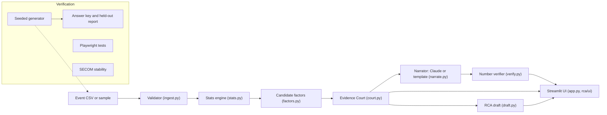

# Architecture

```mermaid
flowchart LR
  CSV["Event CSV or sample"] --> V["Validator (ingest.py)"]
  V --> S["Stats engine (stats.py)"]
  S --> F["Candidate factors (factors.py)"]
  F --> C["Evidence Court (court.py)"]
  C --> N["Narrator: Claude or template (narrate.py)"]
  N --> X["Number verifier (verify.py)"]
  C --> D["RCA draft (draft.py)"]
  X --> UI["Streamlit UI (app.py, rca/ui)"]
  C --> UI
  D --> UI
  subgraph Verification
    G["Seeded generator"] --> K["Answer key and held-out report"]
    E2E["Playwright tests"]
    SE["SECOM stability"]
  end
  G -.-> CSV
```

Teal modules in the design are deterministic code; only the narrator is an AI model, and its output passes the verifier before it reaches the screen.
